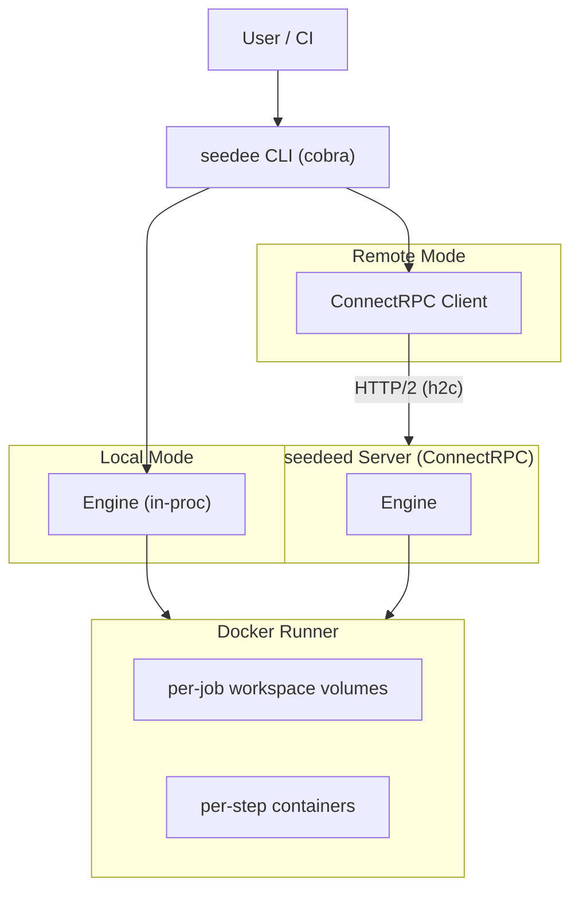
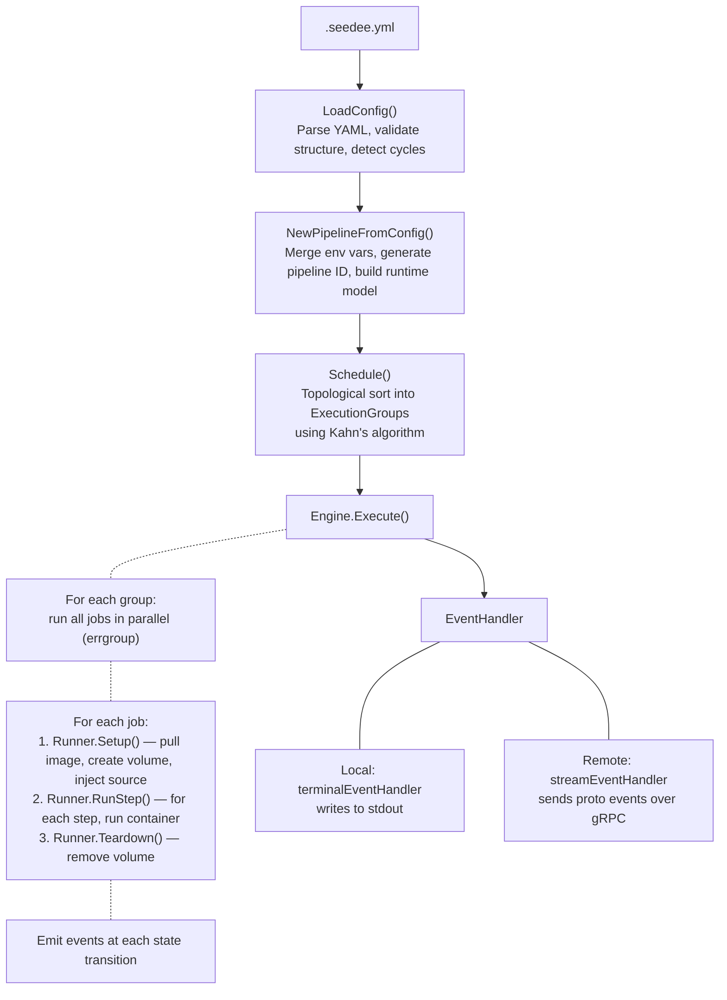

# Architecture

This document describes the internal design of seedee.

## System Diagram



## Package Overview

```
cmd/
  seedee/          CLI entry point — signal handling, cobra root command
  seedeed/         Server entry point — flag parsing, server startup

internal/
  cli/             Cobra commands, terminal UI, ConnectRPC client,
                   config loading, event display, color output
  core/            Pipeline model, YAML config parser & validator,
                   DAG scheduler (Kahn's algorithm), execution engine,
                   event types and handlers
  runner/          Runner interface definition
    docker/        Docker runner implementation — image pulls,
                   container lifecycle, workspace volumes, cleanup
  server/          ConnectRPC service handler, server startup,
                   proto ↔ core conversion, run tracking, pruning

gen/               Generated protobuf and ConnectRPC Go code
proto/             Protobuf service definition (.proto files)
test/              End-to-end tests (local and remote)
testdata/          Sample pipeline configs for tests
```

### `core` — the heart of seedee

| File            | Responsibility                                                   |
|-----------------|------------------------------------------------------------------|
| `model.go`      | Data types: `Pipeline`, `Job`, `Step`, `Status`, result structs |
| `config.go`     | YAML parsing, validation, cycle detection                       |
| `convert.go`    | `PipelineConfig` → runtime `Pipeline` with env merging          |
| `scheduler.go`  | DAG topological sort (Kahn's algorithm) into execution groups   |
| `engine.go`     | Orchestrator: runs groups in order, jobs in parallel, steps sequentially |
| `events.go`     | Event types, `EventHandler` interface, buffered/multi handlers  |
| `log.go`        | Simple stdout event handler for debugging                       |

### `runner` — execution backends

The `Runner` interface has three methods:

```go
type Runner interface {
    Setup(ctx context.Context, job *core.Job) error
    RunStep(ctx context.Context, job *core.Job, step *core.Step, stdout, stderr io.Writer) (*core.StepResult, error)
    Teardown(ctx context.Context, job *core.Job) error
}
```

The only implementation today is `docker.DockerRunner`. To add a new backend
(e.g., Podman, Kubernetes), implement `Runner` and wire it into the engine.

### `server` — remote execution

The server exposes a ConnectRPC service (`CIService`) over HTTP/2 with h2c
(cleartext HTTP/2). Three RPCs:

| RPC                 | Type              | Description                            |
|---------------------|-------------------|----------------------------------------|
| `RunPipeline`       | server-streaming  | Execute pipeline, stream events back   |
| `GetPipelineStatus` | unary             | Query status of a running/finished run |
| `CancelPipeline`    | unary             | Request cancellation of a running run  |

The server tracks active and recently-completed runs in memory and prunes old
runs periodically.

## Data Flow



## Runner Interface and Custom Runners

To implement a custom runner:

1. Create a package under `internal/runner/`.
2. Implement the `runner.Runner` interface:
   - **`Setup`** — prepare the execution environment for a job (e.g., pull
     images, create volumes).
   - **`RunStep`** — execute a single step command, streaming stdout/stderr to
     the provided writers. Return a `StepResult` with the exit code.
   - **`Teardown`** — clean up resources created during `Setup`.
3. Wire it into the engine by assigning it to `Engine.Runner`.

The `DockerRunner` serves as a reference implementation. It creates a workspace
volume per job, optionally injects source code, runs each step in a fresh
container with the volume mounted at `/workspace`, and removes the volume in
teardown.

## ConnectRPC Service Contract

The service is defined in `proto/seedee/v1/seedee.proto`. Key message types:

- **`PipelineDefinition`** — mirrors the YAML config structure.
- **`RunPipelineEvent`** — streamed during execution; carries event type,
  timestamps, log data, status, exit codes, and duration.
- **`Status`** enum — `PENDING`, `RUNNING`, `SUCCESS`, `FAILED`, `SKIPPED`,
  `CANCELED`.
- **`EventType`** enum — `PIPELINE_STARTED`, `PIPELINE_FINISHED`,
  `JOB_STARTED`, `JOB_FINISHED`, `JOB_SKIPPED`, `STEP_STARTED`,
  `STEP_FINISHED`, `STEP_LOG`.

Generated Go code lives in `gen/seedee/v1/` and is produced by `buf generate`.

## Local vs Remote Mode

| Aspect           | Local (`seedee run`)               | Remote (`seedee run --server`)      |
|------------------|------------------------------------|-------------------------------------|
| Engine location  | In the CLI process                 | On the seedeed server               |
| Docker access    | CLI machine's Docker daemon        | Server's Docker daemon              |
| Source code      | Injected from `cwd` into volumes   | Sent as pipeline definition only    |
| Log display      | Direct terminal event handler      | Events streamed over ConnectRPC     |
| Cancellation     | OS signal (Ctrl+C) cancels context | Signal triggers `CancelPipeline` RPC|
